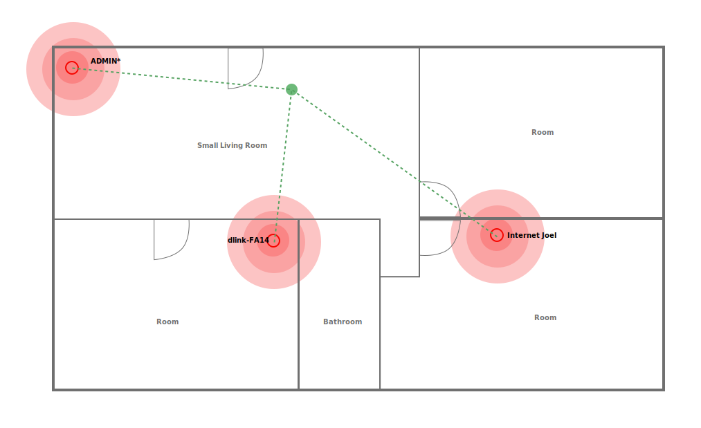
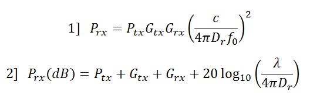
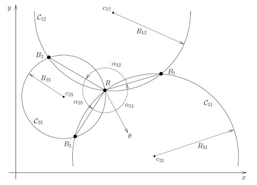
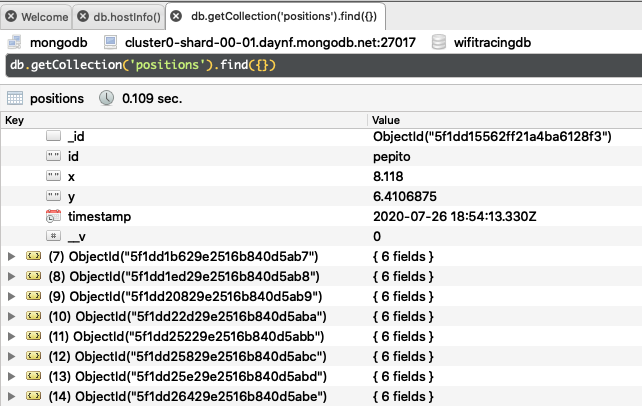
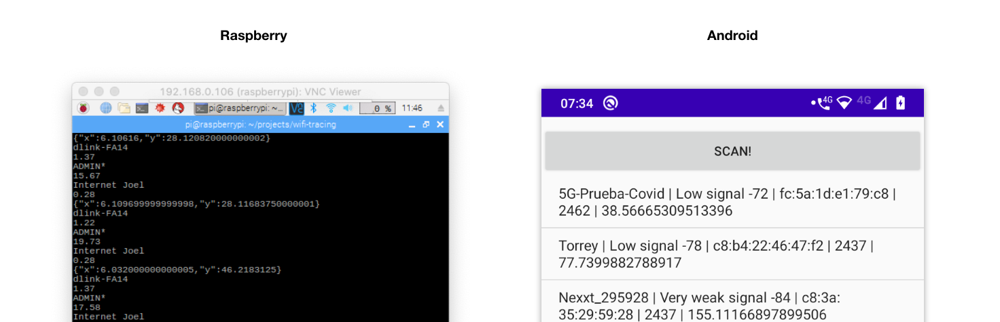

Inspired by [bluetrace](https://bluetrace.io/)

<br />

This alternative propose to use a mutiple wifi signal strength measurements to triangulate the positions within a physical location.

Serve data with indoor x,y positions for contact tracing

This demo contains: 

- An android and raspberry aplications as end user applications.
- A website to monitor the people position in a floorplan. (For demo purpose only)
- A backend where historical positioning data is stored

## How it works?

1. Get the distances from the main wifi points. 



Python
```python
def scan(interface='wlan0'):
    cmd = ["iwlist", interface, "scan"]
    proc = subprocess.Popen(cmd, stdout=subprocess.PIPE, stderr=subprocess.PIPE)
    points = proc.stdout.read().decode('utf-8') 
    return points 
```

Android
```java
IntentFilter intentFilter = new IntentFilter();
intentFilter.addAction(WifiManager.SCAN_RESULTS_AVAILABLE_ACTION);
registerReceiver(wifiScanReceiver, intentFilter);
wifiManager.startScan();
```

### Convert from dBm to meters in a simplified escenario



```python
def dbm2m(frequency, dBm): 
  FSPL = 27.55 #Free-Space Path Loss 
  m = 10 ** (( FSPL - (20 * log10(frequency)) + abs(dBm) ) / 20 ) 
  return round(m, 2)
```

2. Use 2d trilateration algorithm to get x, y position estimation in the floorplan

  Trilateration allow us to estimate position coordinates using distances from recerence points.

  

  ```javascript
    A = 2*x2 - 2*x1
    B = 2*y2 - 2*y1
    C = r1**2 - r2**2 - x1**2 + x2**2 - y1**2 + y2**2
    D = 2*x3 - 2*x2
    E = 2*y3 - 2*y2
    F = r2**2 - r3**2 - x2**2 + x3**2 - y2**2 + y3**2

    x = (C*E - F*B) / (E*A - B*D)
    y = (C*D - A*F) / (B*D - A*E)
  ```

3. Store position trought the time

  Using mongodb as data wharehouse

  


## User interfaces

  


## References

- [User Configurable Indoor
Positioning System using WiFi
Trilateration and Fingerprinting](https://www.diva-portal.org/smash/get/diva2:1105921/FULLTEXT02)
- [On Improved Projection Techniques to Support Visual Exploration of Multidimensional DataSets](http://repositorio.icmc.usp.br/bitstream/handle/RIICMC/6868/relatorio_207.pdf?sequence=1http://repositorio.icmc.usp.br/bitstream/handle/RIICMC/6868/relatorio_207.pdf?sequence=1)

